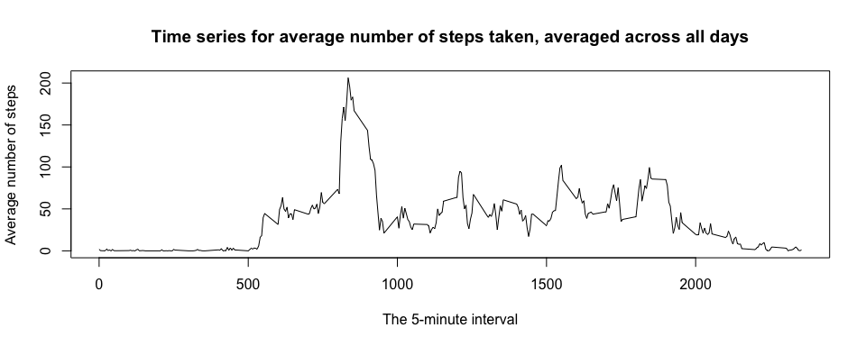

## Loading and preprocessing the data

First, clear R environment and load necessary libraries.

```r
rm(list=ls())
library(data.table); library(dplyr); library(knitr); library(ggplot2); library(Hmisc)
```

Show any code that is needed to

1. Load the data (i.e. read.csv())


```r
if(!file.exists('activity.csv')){
        unzip('activity.zip')}
activity <- read.csv('activity.csv')
```

2. Process/transform the data (if necessary) into a format suitable for your analysis


```r
activity$date <- as.Date(as.character(activity$date), '%Y-%m-%d') # convert to date datatype
```

## What is mean total number of steps taken per day?
For this part of the assignment, you can ignore the missing values in the dataset.

1. Calculate the total number of steps taken per day


```r
steps_per_day <- tapply(activity$steps, activity$date, sum, na.rm=TRUE)
head(steps_per_day, 2); tail(steps_per_day, 2)
```

```
## 2012-10-01 2012-10-02 
##          0        126
```

```
## 2012-11-29 2012-11-30 
##       7047          0
```

2. Make a histogram of the total number of steps taken each day


```r
# Prepare data for plotting
 steps_per_day <- activity %>%
        group_by(date) %>%
        summarise(totalSteps = sum(steps, na.rm=TRUE))

# Plotting histogram
plot1 <- ggplot(steps_per_day, aes(steps_per_day$totalSteps)) + 
        geom_histogram(col="black", aes(fill=..count..), alpha = .8, binwidth = 2000) +
        labs(title = "Histogram of the total number of steps taken each day",
             x = "Steps per day", y = "Frequency")
plot1
```

<!-- -->

3. Calculate and report the mean and median of the total number of steps taken per day

Results could be different as they depend on the 0 steps (if 0 steps are included or not).
For example, 0 steps do not bring any addition to the sum of the total number of steps,
but if they are counted into the average, then the denominator is larger and hence the average is smaller.

Case 1: Including 0 steps

```r
Mean_steps_per_day_0_included <- mean(steps_per_day$totalSteps)     # 0 steps are counted
Median_steps_per_day_0_included <- median(steps_per_day$totalSteps) # 0 steps are counted
Mean_steps_per_day_0_included; Median_steps_per_day_0_included # Mean and Median are smaller (0 steps counted)
```

```
## [1] 9354.23
```

```
## [1] 10395
```
Case 2: Excluding 0 steps

```r
steps_per_day_0_excluded <- aggregate(steps ~ date, activity, sum, na.rm=TRUE)
Mean_steps_per_day <- mean(steps_per_day_0_excluded$steps)     # 0 steps are excluded
Median_steps_per_day <- median(steps_per_day_0_excluded$steps) # 0 steps are excluded
Mean_steps_per_day; Median_steps_per_day   # Mean and Median are larger when 0 steps are excluded
```

```
## [1] 10766.19
```

```
## [1] 10765
```

## What is the average daily activity pattern?
1. Make a time series plot of the 5-minute interval (x-axis) and the average number of steps taken, averaged across all days (y-axis).


```r
avg_steps_per_interval <- aggregate(steps ~ interval, activity, mean, na.rm=TRUE)
head(avg_steps_per_interval, 2)
```

```
##   interval     steps
## 1        0 1.7169811
## 2        5 0.3396226
```
Time series plot:

```r
plot(avg_steps_per_interval$interval, avg_steps_per_interval$steps, type = "l", 
     main = "Time series for average number of steps taken, averaged across all days",
     xlab = "The 5-minute interval",  ylab = "Average number of steps")
```

<!-- -->

2. Which 5-minute interval, on average across all the days in the dataset, contains the maximum number of steps?


```r
identified_interval <- which.max(avg_steps_per_interval$steps)
intervalMax <- avg_steps_per_interval[identified_interval,]
IdMax_interval <- intervalMax$interval # 5- minute interval with the highest average steps
Max_steps <- intervalMax$steps         # maximum number of steps
IdMax_interval; Max_steps
```

```
## [1] 835
```

```
## [1] 206.1698
```

## Imputing missing values
Note that there are a number of days/intervals where there are missing values. The presence of missing days may introduce bias into some calculations or summaries of the data.

1. Calculate and report the total number of missing values in the dataset (i.e., the total number of rows with NAs).

```r
Total_val <- length(activity$steps)
Missing_val <- length(which(is.na(activity$steps)))
Total_val; Missing_val
```

```
## [1] 17568
```

```
## [1] 2304
```

2. Devise a strategy for filling in all of the missing values in the dataset. The strategy does not need to be sophisticated. For example, you could use the mean/median for that day, or the mean for that 5-minute interval, etc.

```r
activity_fill_NAs <- activity
activity_fill_NAs$steps <- round(impute(activity$steps, fun=mean), digits = 0)
```

3. Create a new dataset that is equal to the original dataset but with the missing data filled in.

```r
New_Total_val <- length(activity_fill_NAs$steps)
New_Missing_val <- length(which(is.na(activity_fill_NAs$steps)))
New_Total_val; New_Missing_val
```

```
## [1] 17568
```

```
## [1] 0
```
4. Make a histogram of the total number of steps taken each day (with the missing data filled in). 

```r
# Prepare data for plotting
 Sum_activity_fill_NAs <- activity_fill_NAs %>%
        group_by(date) %>%
        summarise(totalSteps = sum(steps, na.rm=TRUE))

# Plotting histogram
plot3 <- ggplot(Sum_activity_fill_NAs, aes(Sum_activity_fill_NAs$totalSteps)) + 
        geom_histogram(col="black", aes(fill=..count..), alpha = .8, binwidth = 2000) +
        labs(title = 
            "Histogram of the total number of steps taken each day - missing data filled in",
             x = "Total steps per day", y = "Frequency")
plot3
```

<!-- -->

Calculate and report the mean and median total number of steps taken per day. Do these values differ from the estimates from the first part of the assignment? 

Following the previous discussion, we should consider two cases, when 0 steps are included or not.

Case 1: Including 0 steps

```r
New_Mean_steps_per_day_0_included <- mean(Sum_activity_fill_NAs$totalSteps)  # 0 steps counted
New_Median_steps_per_day_0_included <- median(Sum_activity_fill_NAs$totalSteps) # 0 steps counted
New_Mean_steps_per_day_0_included; New_Median_steps_per_day_0_included 
```

```
## [1] 10751.74
```

```
## [1] 10656
```
Case 2: Excluding 0 steps

```r
New_steps_per_day_0_excluded <- aggregate(steps ~ date, activity_fill_NAs, sum, na.rm=TRUE)
New_Mean_steps_per_day <- mean(steps_per_day_0_excluded$steps)     # 0 steps are excluded
New_Median_steps_per_day <- median(steps_per_day_0_excluded$steps) # 0 steps are excluded
New_Mean_steps_per_day; New_Median_steps_per_day   # Mean and Median are larger when 0 steps are excluded
```

```
## [1] 10766.19
```

```
## [1] 10765
```

What is the impact of imputing missing data on the estimates of the total daily number of steps?

For a better view, ratios between mean (median) "with NAs filled in", and the corresponding mean(median) from the first part of the assignment, are computed for both Case 1 and Case 2.

```r
# Case 1: Inclusing 0 steps
New_Mean_steps_per_day_0_included/Mean_steps_per_day_0_included
```

```
## [1] 1.149399
```

```r
New_Median_steps_per_day_0_included/Median_steps_per_day_0_included
```

```
## [1] 1.025108
```

```r
# Case 2: Excluding 0 steps
New_Mean_steps_per_day/Mean_steps_per_day
```

```
## [1] 1
```

```r
New_Median_steps_per_day/Median_steps_per_day 
```

```
## [1] 1
```

Calculations show that mean(median) imputation on the missing variables do not change mean/median in the Case 2. This is slightly different in the Case 1. There are pros and cons regarding when mean imputation is appropriate for replacing missing variables. In our case, frequencies of the histogram increased (except or 0 steps) when missing NAs were replaced by mean. 

## Are there differences in activity patterns between weekdays and weekends?
For this part the weekdays() function may be of some help. Use the dataset with the filled-in missing values for this part.

1. Create a new factor variable in the dataset with two levels – “weekday” and “weekend” indicating whether a given date is a weekday or weekend day.

```r
activity_fill_NAs$dateType <-  ifelse(as.POSIXlt(activity_fill_NAs$date)$wday %in% c(0,6), 'weekend', 'weekday')
```

2. Make a panel plot containing a time series plot of the 5-minute interval (x-axis) and the average number of steps taken, averaged across all weekday days or weekend days (y-axis). 

```r
Interval_activity_fill_NAs <- aggregate(steps ~ interval + dateType, activity_fill_NAs, mean)
plot4 <- ggplot(Interval_activity_fill_NAs, aes(interval, steps, colour = dateType)) + 
        geom_line(linetype = "solid", size = 1) + facet_grid(dateType ~ .) +
        labs(title = "Time series for average number of steps/frequency distribution",
             x = "The 5-minute interval", y = "Average number of steps taken")
plot4
```

<!-- -->

The panel plot shows differences in activity patterns between weekdays and weekends:

(i) weekday activity is mostly in the morning with the highest pick (>200) in the morning, and another emphasized pick (>100) later in the day.

(ii) weekend activity is spread out through the day with many picks >100. The higest pick (~150) is achieved in the morning.
